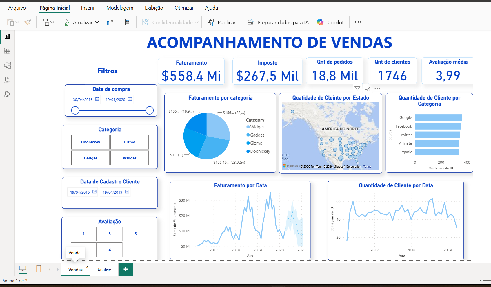
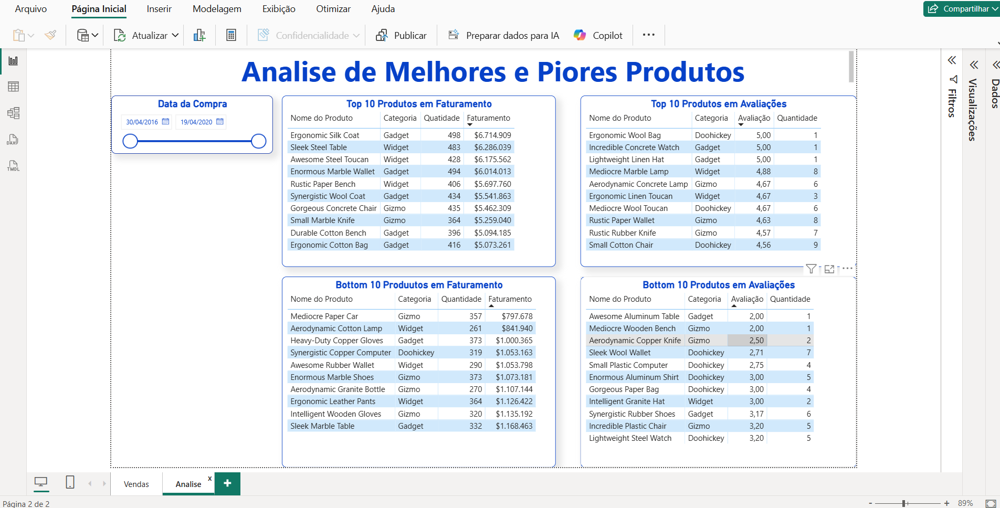

# Dashboard de Acompanhamento de Vendas

## 📊 Sobre o projeto

Projeto desenvolvido em Power BI para acompanhamento e análise de indicadores comerciais.

O dashboard transforma dados de vendas em informações visuais, permitindo analisar o faturamento, clientes, pedidos, avaliações e desempenho dos produtos.

## 🛠️ Ferramenta utilizada

- Power BI

## 📈 Acompanhamento de Vendas

A primeira página do dashboard apresenta indicadores e análises relacionados ao desempenho comercial.

### Principais indicadores

- Faturamento
- Impostos
- Quantidade de pedidos
- Quantidade de clientes
- Avaliação média

### Principais análises

- Faturamento por categoria
- Quantidade de clientes por estado
- Quantidade de clientes por categoria
- Evolução do faturamento ao longo do tempo
- Evolução da quantidade de clientes
- Filtros por período, categoria e avaliação

## 🏆 Análise de Melhores e Piores Produtos

A segunda página apresenta uma análise comparativa do desempenho dos produtos.

### Principais análises

- Top 10 produtos em faturamento
- Bottom 10 produtos em faturamento
- Top 10 produtos em avaliações
- Bottom 10 produtos em avaliações

## 🖥️ Dashboard

### Acompanhamento de Vendas

### Análise de Melhores e Piores Produtos

## 🎯 Objetivo

Utilizar o Power BI para transformar dados comerciais em informações de fácil interpretação, permitindo acompanhar indicadores, identificar produtos de maior e menor desempenho e apoiar a tomada de decisões baseada em dados.
